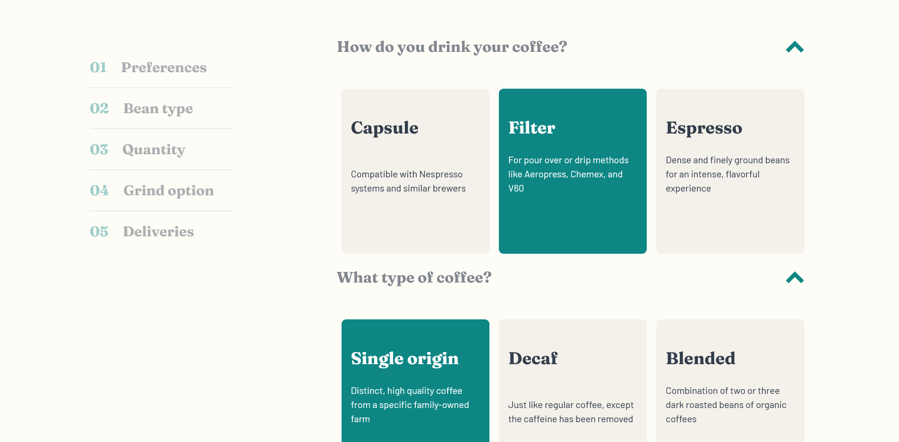

# Frontend Mentor - Coffeeroasters subscription site solution

This is a solution to the [Coffeeroasters subscription site challenge on Frontend Mentor](https://www.frontendmentor.io/challenges/coffeeroasters-subscription-site-5Fc26HVY6). Frontend Mentor challenges help you improve your coding skills by building realistic projects.

## Table of contents

- [Overview](#overview)
  - [The challenge](#the-challenge)
  - [Screenshot](#screenshot)
  - [Links](#links)
  <!-- - [My process](#my-process) -->
  - [Built with](#built-with)
  - [What I learned](#what-i-learned)
  - [Continued development](#continued-development)
  - [Useful resources](#useful-resources)
- [Author](#author)
- [Acknowledgments](#acknowledgments)

## Overview

This challenge took me exactely 8 days, with 4-5 hours of work daily. I added a few small details such as an overlay behind the modal on the plan page when checking out, sticky position and additional styling on the left side content map to give a better feedback on the completion progess. I used a mobile-first approach and imported all the SVG's through a sprite, a thing I wish I knew about longer before.

### The challenge

Users should be able to:

- View the optimal layout for each page depending on their device's screen size
- See hover states for all interactive elements throughout the site
- Make selections to create a coffee subscription and see an order summary modal of their choices

### Screenshot



### Links

- Solution URL: [https://www.frontendmentor.io/solutions/coffee-roasters-KfOk9wBoU]
- Live Site URL: [https://coffeeroast.netlify.app/index.html]

### Built with

- Mobile-first workflow
- Semantic HTML5 markup
- CSS custom properties
- Flexbox
- Javascript

### What I learned

First time I used a sprite sheet.
Cool and easy way to get all the benefits of SVG while only making one http request for all the elements on the page.

```html
<div class="socials">
  <svg class="icon" role="img">
    <use xlink:href="sprite.svg#icon-facebook"></use>
  </svg>
  <svg class="icon" role="img">
    <use xlink:href="sprite.svg#icon-instagram"></use>
  </svg>
  <svg class="icon" role="img">
    <use xlink:href="sprite.svg#icon-twitter"></use>
  </svg>
</div>
```

Using em, rem, and vw with 'clamp'. These units save you from the 'media queries hell'!
Paddings, margins and border radiuses dynamically update while maintaining good proportions. No longer the need to rewrite them for each media query.

```scss
.illustration {
  width: clamp(30px, 15vh, 100px);
}

button {
  user-select: none;
  display: flex;
  color: #fefcf7;
  padding: 1em 2em;
  border-radius: 0.5rem;
  font-family: 'Fraunces', sans-serif;
  margin: 3em auto 1em auto;
  border: none;
  font-size: 1rem;
  background-color: hsl(179, 81%, 29%);
  transition: 100ms background-color;
  &:hover {
    cursor: pointer;
    background-color: #66d2cf;
  }
}
```

### Continued development

In the future I will only write my css from mobile to desktop. Doing this I will end up with a more fluid development, less unexpected behaviors and a way cleaner stylesheet. I have to work more on the JS logic that happens behind the scenes. In this one a lot of the 'magic' is based on the DOM, so if you inspect element the price of one card on the plan page and change it to any number you will affect the checkout generated price. I will completely separate the javascript logic from the visual stuff on the next challenges. One aspect that I have avoided in my learning journey was transitions. The arrows in the plan page are not rotating naturally, because of this I found myself wasting a lot of time trying to get them to work, they only rotate beautifully when clicking on the left side choices map on desktop view. Weird.
I'm looking forward learn new ways of accelerating my workflow and get a better grip of transitions.

### Useful resources

- [Kevin Powell's Youtube channel](https://www.youtube.com/user/KepowOb) - I can't not credit Kevin, he is amazing! His videos and online resources are the best. If you're in a process of learning/mastering CSS you've surely stumbled across his videos, if not, you must check him out asap. I took a lot of good practices from him including the 'mobile first' type of development which substantially accelerated my workflow on this one.

## Author

<!-- - Website - [Add your name here](https://www.your-site.com) -->

- Frontend Mentor - [@popescudragos](https://www.frontendmentor.io/profile/popescudragos)
- Linkedin - [@ospop](https://www.linkedin.com/in/ospop/)
